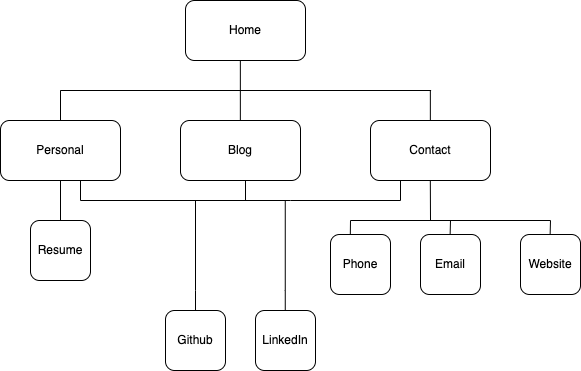
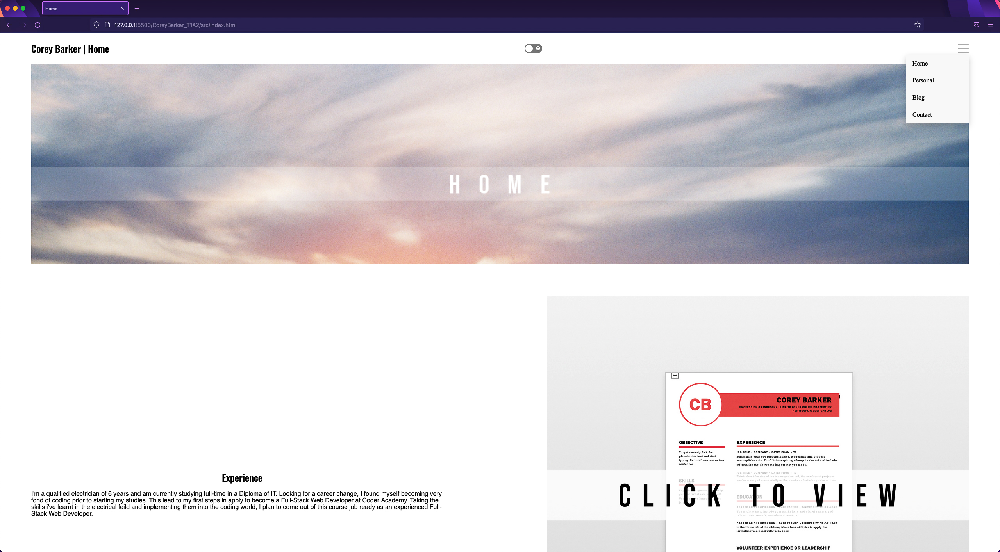
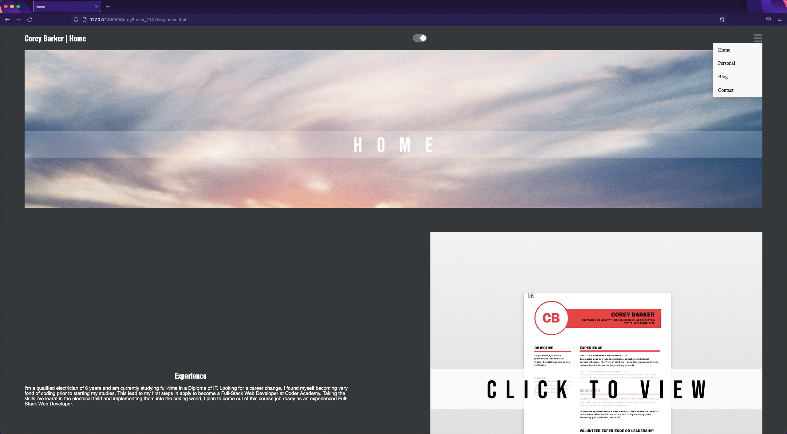
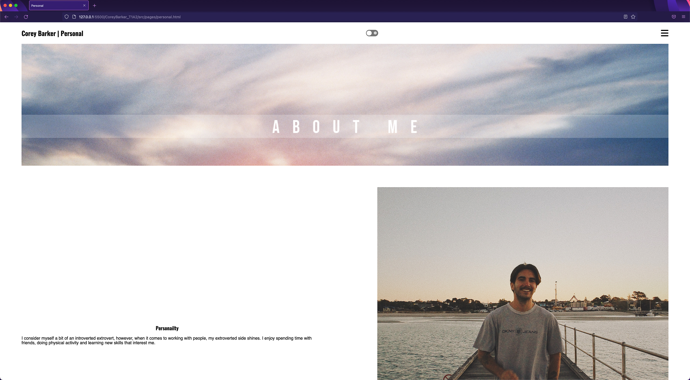
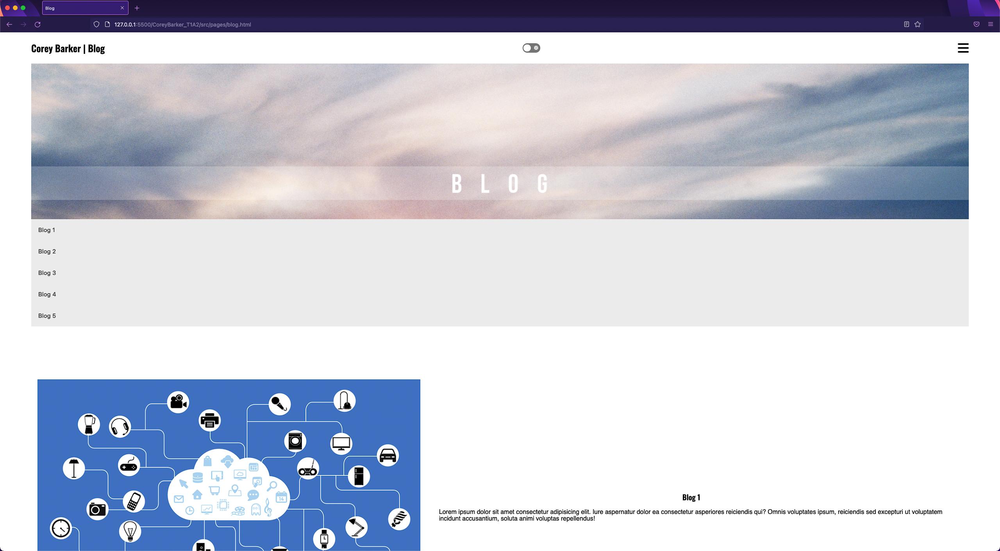
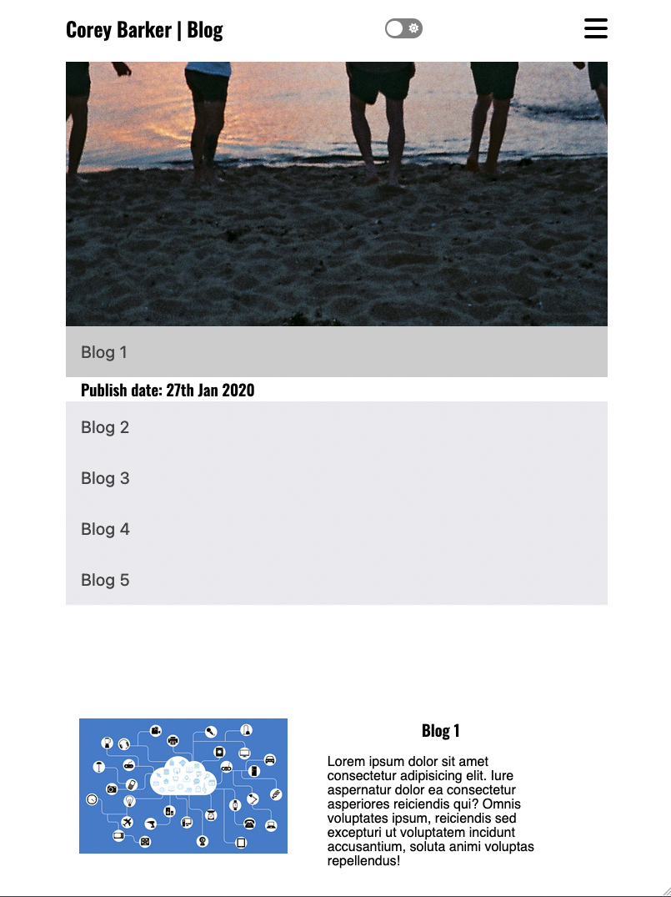
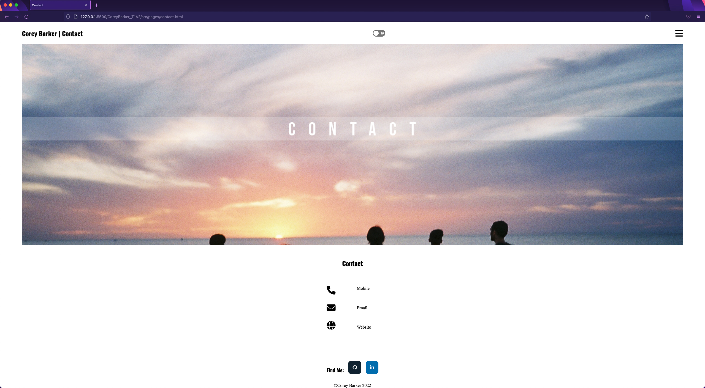
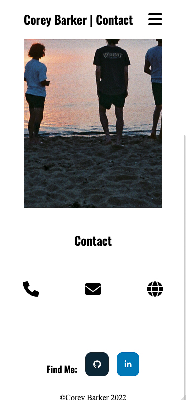

# CoreyBarker_T1A2
---
https://coreybarkerportfolio.netlify.app/

https://github.com/coreybarker/T1A2

## Purpose
The website is designed to act as a window into my life, professionally and personally for future clients and employers. The website expresses my design choices to provide an asthetically clean approach, without the loss of funtionality.

---

## Features

My sites features are spread across 4 pages linked together.

- All pages are tied thematically with a parallax component at the top of each page, paired with a fixed navbar up the top to wrap each page in a small border.
  
- Each page has a drop down menu in the top right of the nav bar for page navigation. Also featuring a 'Find Me' section at the footer linking to Github and Linked in. 

- All pages also include a toggle switch at the top to change the sites colours into a dark theme, if being viewed at night. This feature is disabled in phone views.

- The Home page displays a brief description of my professional background, with a sample of my resume that can be clicked on to view the PDF.

- The Personal page shows information about my personality and interests outside of work with  pictures for more context.

- The Blog page displays a list of blogs with a collapse feature to reveal the publish date of each. Below that is the 5 sample blog posts paired with images. The collapse feature is disabled in phone views.

- The Contact page displays a list of my contact details in clickable icons with descriptions beside. This directs the user to a phone call, email or the homepage of the website. This is shown under the parallax feature like the 3 previous pages.
The order of the icons change with the descriptions being disable to suit phone views.
  
---

## Sitemap

Home, Personal, Blog & Contact pages link to each other as well as to Github and LinkedIn. Personal links to my resume and Contact links to my email, website homepage and a phone call.

---

## Screenshots

---

## Target Audience

The target audience for this website is future employers, IT professionals and future clients.

---

## Tech Stack

I've used a combination of HTML and CSS to deisgn and construction my website. I used small amounts of Javascript to add extra features that HTML and CSS couldn't otherwise achieve.

I will be using Netlify to deploy my website.