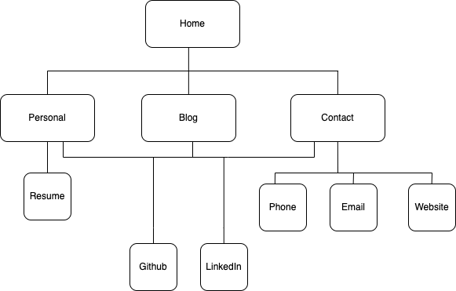

# CoreyBarker_T1A2
---
## Purpose
The website is designed to act as a window into my life, professionally and personally for future clients and employers. The website expresses my design choices to provide an asthetically clean approach, without the loss of funtionality.

---

## Features

My sites features are spread across 4 pages linked together.

- All pages are tied thematically with a parallax component at the top of each page, paired with a fixed navbar to wrap each page in a small border.
  
- Each page has a drop down menu in the top right of the nav bar for page navigation. Also featuring a 'Find Me' section at the bottom linking to Github and Linked in. 

- The Home page displays a brief description of my professional background, with a sample of my resume that can be clicked on to view the PDF.

- The Personal page shows pictures of me with information about my personality and interests.

- The Blog page displays a list of blogs with a collapse feature  to reveal the publish date of each. This feature is then turned off in mobile view. Below that is the 5 sample blog posts paired with images.

- The Contact page displays my contact details in clickable icons with the label of each next to the icons. This directs the user to a phone call, email or the homepage of the website. This is shown under the parallax feature that is shown on the 3 previous pages.
  
---

## Sitemap

Home, Personal, Blog & Contact pages link to each other as well as to Github and LinkedIn. Personal links to my resume and Contact links to my email, website homepage and a phone call.

---

## Wireframes

